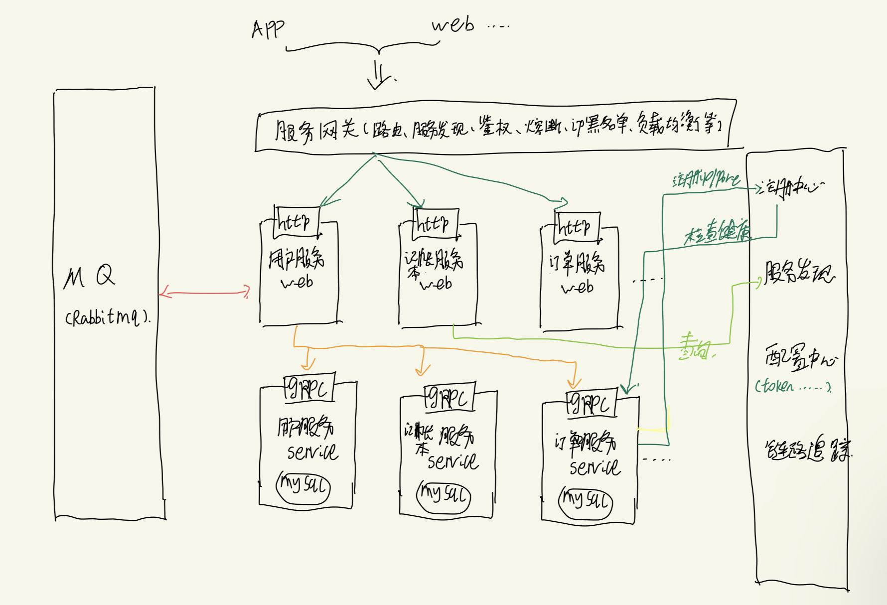

# Economic Bookkeeping

一个纯粹的经济学记账工具，而不是理财产品的大杂烩。  
Copyright 2023 YinLei.

## Overview

`Economic Bookkeeping` is an open source project that makes it easy to build simple, reliable, and efficient economic's 
bookkepping software.

## Design

distributed applications and services.  

Note that this picture may change in the future.

`Q: 为什么这样设计？为什么选择微服务？`  
`A: 1.在传统的后端开发中，以目前流行的单体应用(如前后端分离)为例，适合中小公司和人员较少的情况，最常见的问题就是代码的merge conflict并持续修改提测。
另一个头疼的问题就是要考虑不断增加的功能需求和并发性支持。2.许多人说不应该盲目使用微服务，这样的结果会导致滥用微服务。是的！使用微服务也会产生相应的问题，
比如使用微服务后网关的问题以及在众多grpc中怎么去快速定位等等。3.明确您是不是应该需要使用微服务，应该以不断增长的功能需求+并发性支持为出发点。比如，现在
您有一套网页+网站后台管理页，您为其开发了相应的API，现在新需求是在此基础上开发微信小程序，面对很多重复的功能你会怎么做，分层设计？数据库怎么设计？单体还是
集群？实现一个功能需要动数据库，性能瓶颈在哪？怎么隔离带来的副作用等等。4.基于以上的考虑，我选择golang+grpc+protobuf+docker.`

## Features

the key features of `Economic Bookkeeping` are:
- 纯净记账：功能丰富，操作简单，快速查找每一笔消费
- 每日收支小票：打印每日收支小票
- 周期记账：重复记账、订阅支付、分期支付
- 资产管理：支持各个银行卡、支付宝、微信等资产账号，方便管理统计负债、净资产，轻松知道个人财务情况
- 导出导入：导出数据为csv格式，或者导入其他格式数据，让你自主分析数据
- 共享账本：和家人、好友一起记账
- 付费多账本：免费提供3个账本，针对中小私人商家，提供更专业的记账工具，每月付费订阅无限制账本
- 桌面小组件：快捷记账，通通都可以放到手机桌面
- 预算管理：科学存钱计划，《小狗钱钱》带你计划您的支出
- 经济学科普：每日趣味经济学科普，《牛奶可乐经济学》等书籍片段引起你的兴趣、增长知识
- 小助手：chatgpt为你每日收支情况给出合适的经济学建议 
- 云端同步：在iPhone、iPad、Android、Windows、MacOS、Linux、Web之间同步数据

## Tools

- [GoLand]()
- [PostMan]()
- [DataGrip]()
- [Chrome]()
- [Docker]()
- [Ubuntu]()
- [MySQL]()
- [Redis]()

## References

- [protoc](https://protobuf.dev/)
- [protoc-gen-go](https://pkg.go.dev/github.com/golang/protobuf/protoc-gen-go)
- [grpc](https://grpc.io/docs/languages/go/)
- [gin](https://github.com/gin-gonic/gin)
- [zap](https://github.com/uber-go/zap)
- [go-password-encoder](https://github.com/anaskhan96/go-password-encoder)
- [viper](https://github.com/spf13/viper)
- [golang-jwt](https://github.com/golang-jwt/jwt)
- [base64Captcha](https://github.com/mojocn/base64Captcha)
- [阿里云短信平台](https://next.api.aliyun.com/api/Dysmsapi/2017-05-25/SendSms?params=%7B%22RegionId%22%3A%22cn-hangzhou%22%2C%22PhoneNumbers%22%3A%22%22%2C%22SignName%22%3A%22%22%2C%22TemplateCode%22%3A%22%22%7D&tab=DEMO&lang=GO)
- [go-redis](https://redis.uptrace.dev/)

## Contributing

Contributors are highly welcome and the repositories are hosted on Github. I look forward to community feedback, additions
and bugs. If you have ideas for a project around `Economic Bookkeeping`, read guidelines and submit here. I appreciate 
your help!

To contribute, please read the contribution guidelines at 
[https://github.com/yinleiCoder/Economic-Bookkeeping-Server/wiki](https://github.com/yinleiCoder/Economic-Bookkeeping-Server/wiki).

Note that the `Economic Bookkeeping` project uses the issue tracker for bug reports and proposals only.